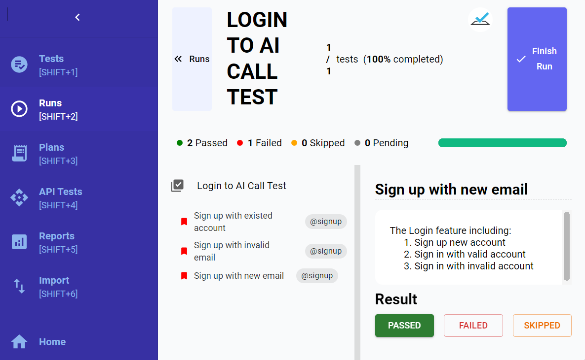

# Web-based Test Management System for Test Automation
## Hệ thống quản lí kiểm thử cho kiểm thử tự động

This web application is willing to allow non-technical testers to engage in automated tests design and execution (using Gherkin), providing the ease of managing manual and automated tests. Also, this web app has been deployed at [Vbee Jsc.](https://vbee.ai/), it's suitable for small companies or start-ups, which have limied human and finacial resources.

Ứng dụng web này cho phép các testers không có kiến thức và chuyên môn về lập trình và công nghệ kiểm thử tự động có thể thiết kế và thực hiện các kiểm thử tự động bằng ngôn ngữ tự nhiên (Sử dụng Gherkin), giúp dễ dàng quản lý các kiểm thử thủ công và tự động. Hệ thống đã được triển khai tại [Vbee](https://vbee.ai/), và đã thể hiện sự phù hợp với những công ty và start-up nhỏ có nguồn nhân lực và tài chính hạn chế muốn phát triển và kiểm thử phần mềm nhanh và hiệu quả.
## 1. Proposed pipeline for managing tests
Quy trình đề xuất cho quản lí kiểm thử
### 1.1. General proposed test process
Quy trình quản lí kiểm thử chung

This proposed general process is based on STLC and BDD, considerably enhanced the  rapid and effectiveness of test management.


The proposed process of managing both 2 types of tests.
### 1.2. Cucumber-based pipeline
Quy trình kiểm thử khi áp dụng với Cucumber framework

The proposed process utilized with Cucumber contains 5 stages of manual testing and 3 stages of automated testing.

## 2. Technology
Công nghệ sử dụng

**Front-end:** React.js; Material UI\
**Back-end:** Java Spring Boot\
**Database:** MySQL\
**Test Automation:** Selenium Webdriver, Cucumber framework, REST-Assured
## 3. Instruction to run
### 3.1. Front-end
Required Installation:
- Node.js: [Download and install Node.js](https://nodejs.org/en/download/package-manager/current)
- npm: [Download and install npm](https://docs.npmjs.com/downloading-and-installing-node-js-and-npm)
- Install necessary packages:

    ```bash
    npm install
- Run the application:
  ```bash
  npm start
### 3.2. Back-end
Required Installation:
- Java Development Kit (JDK) 8 or later
- Maven 3.6.0 or later

Database Configuration:
- Update file: `src/main/resources/application.properties` with the configuration of database.

Install dependencies:
    ```
    mvn install
    ```
### 3.3. Database
Required Installation: MySQL
The SQL file for database creation: [test-tool.sql](test-tool.sql)\
The Database Diagram and ER Diagram:


## 4. Main features
These are key functions represented by 8 captured screen pictures, including CRUD Project, Import Cucumber file, Test execution, Test report, Test case Management, Continue executing test case, Finish test execution and Test case Creation.




